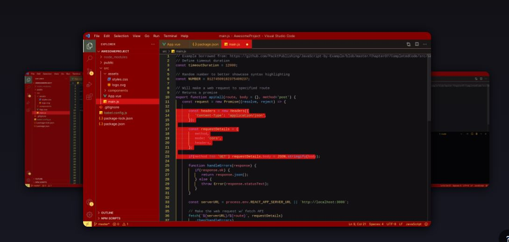
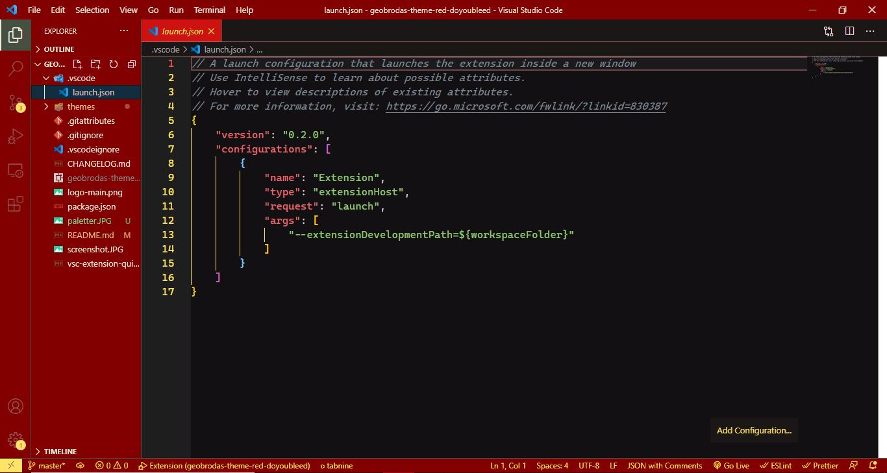
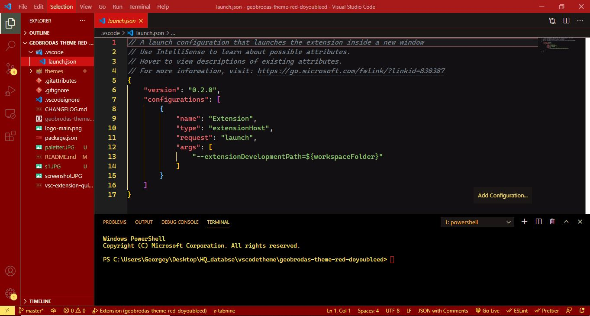
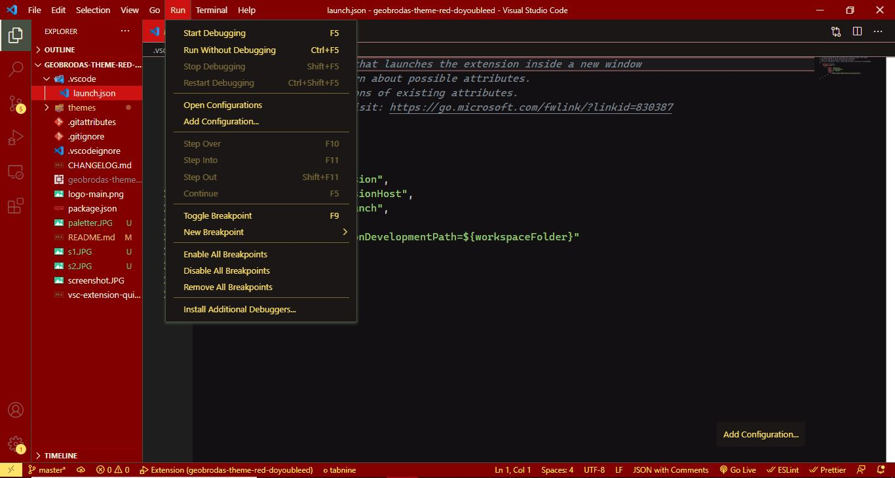

## Do You Bleed?

### What's new?

- Updated the Tree Indent Lines
- Few minor changes to the terminal
- Changed colour for Active Tabs.
- We are hearing you'll, do let us know for any changes..!!

I seriously, don't know how I came up with this theme.
Bascially it's a combination of Deadpool + Spiderman + Iron Man + Iconic Batman dialogue 'Do you Bleed?'

**Extension for the HardCore Coders**

Finally made my dream theme. Red is like my Beast Color Palette.
The Pallete consists of :-

- #eeebdd
- #ce1212
- #810000
- #1b1717
- #ffe268
- #ffb037
- #feff89

### Theme Screenshots

  

  

### How to contribute to the theme?

- Check out the GitHub repo [here](https://github.com/GeoBrodas/doyoubleed)
- Support! Give out some ⭐.
- Give a review! Let me know what should I include.

### Follow me on

Social : [Twitter](https://twitter.com/BrodasGeo)
Blog : [Dev](https://dev.to/geobrodas) [Hashnode](https://geobrodas.hashnode.dev/)

### For more information

- [Visual Studio Code's Markdown Support](http://code.visualstudio.com/docs/languages/markdown)
- [Markdown Syntax Reference](https://help.github.com/articles/markdown-basics/)

**Enjoy the theme!**
